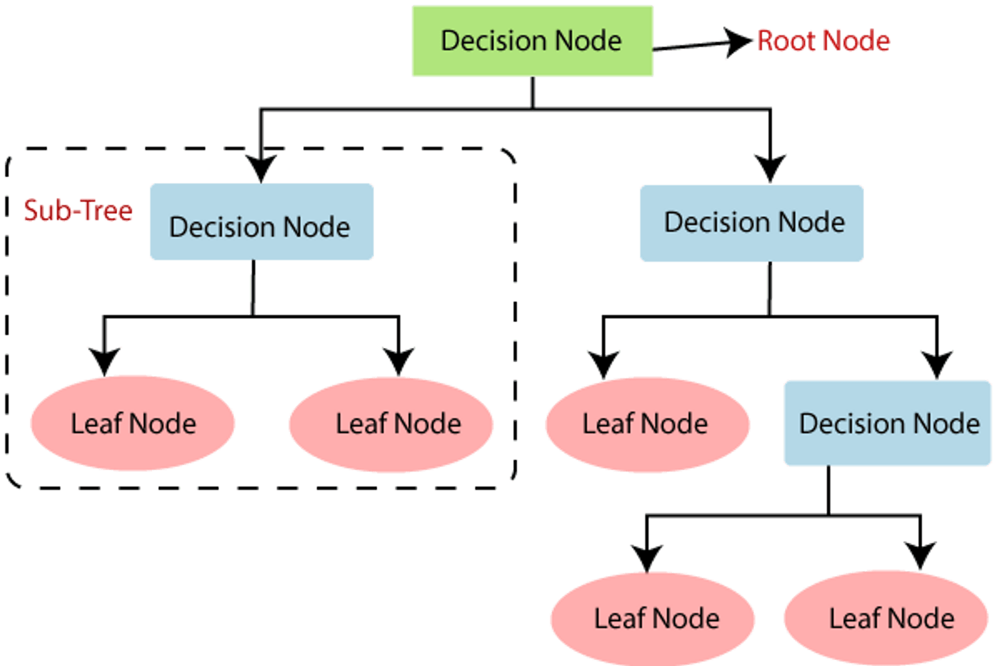
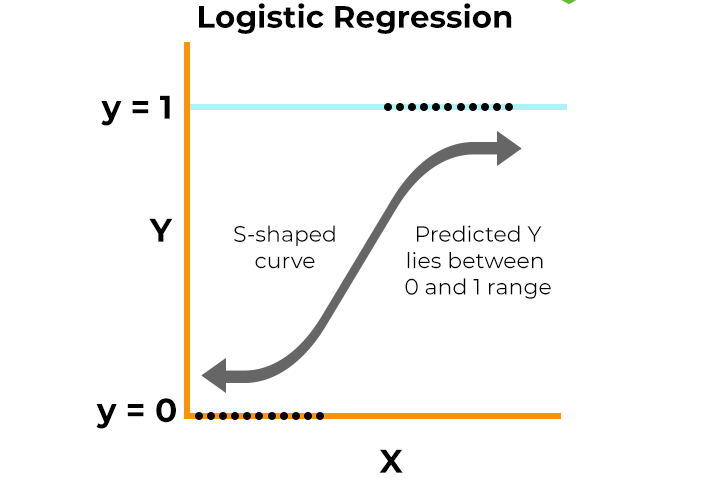
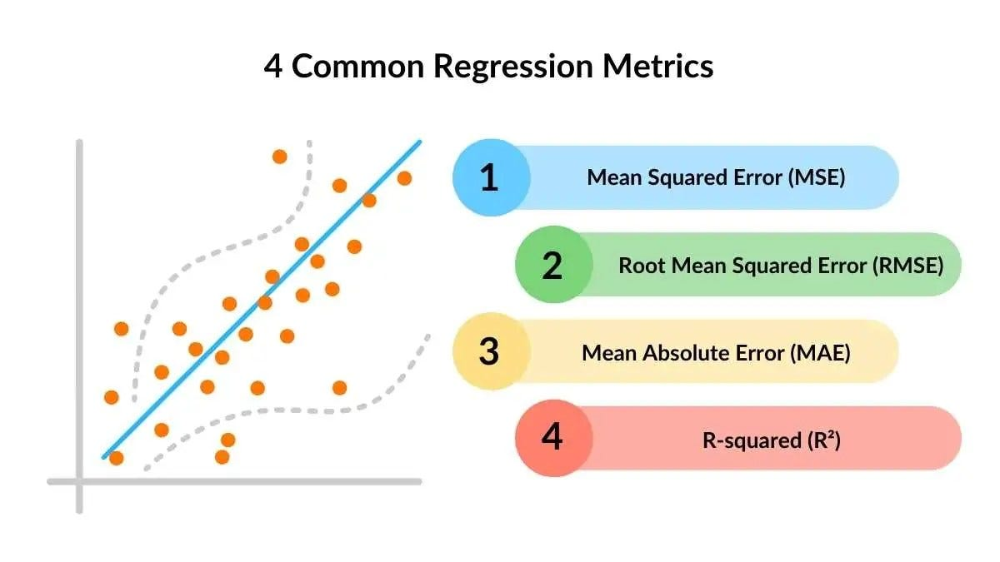

# Day 2: Model Training and Analysis
## Complete Documentation Guide

---

## 1. Overview

This workshop introduces fundamental machine learning concepts with practical implementation. You'll learn how to:
- Split data for training and testing
- Implement multiple regression and classification models
- Evaluate model performance
- Compare and select the best model

**Dataset**: Real estate pricing data 

### Workshop Resources (Make a copy and run the cells) :
1. **Model Training(Regression) :**    
[ML_Workshop_Day2_Regression](https://colab.research.google.com/drive/1OJKjqnp6zMdjilnRdZkCm-De1M91Ax8v?usp=sharing)

2. **Preprocessing of Classification dataset :**  
[Drugclassification_Preprocessing](https://colab.research.google.com/drive/1DvOHTXz8iPYrH-0NSuyq19W1_E-TBpey?usp=sharing)

3. **Model Training(Classification) :**  
[ML_Worshop_Day2_Classification](https://colab.research.google.com/drive/1eVj2YmoO9bbze7IZnl1IsBGroT4skyxm?usp=sharing)

4. **Dataset Files :**  
[Datasets](../files/day2/Datasets.zip)

---

## 2. Dataset Information

### Preprocessed Dataset
- **Total Records**: 10,835 properties
- **Features**: 246 (after preprocessing)
- **Target Variable**: `price` (continuous numerical value) - that we want to predict

### Feature Preparation
- The first step we do after pre processing our dataset, is split the features and target
- Target : what we are predicting
- Features : the properties that we use to predict certain value

```python
# Separating features and target
# Features: drop 'price' (target), keep all others
feature_cols = [col for col in df1.columns if col != 'price']
X = df1[feature_cols]
y = df1['price']


# Dataset shape
Features: (10835, 244)
Target: (10835,)
```

---

## 3. Overfitting and Underfitting
When building machine learning models, the goal is to **capture the true underlying patterns in data** so the model can **generalize** to new, unseen examples.  

However, models can sometimes go wrong in two common ways:

1. **Overfitting**
2. **Underfitting** 


Striking the **right balance** between underfitting and overfitting is key to building robust machine learning models.

### 3.1. Overfitting
Overfitting happens when a model learns too much from the training data, including details that don’t matter (like noise or outliers).

**Example :**
- Imagine fitting a very complicated curve to a set of points. The curve will go through every point, but it won’t represent the actual pattern.
- As a result, the model works great on training data but fails when tested on new data.


**Reasons for Overfitting:**

1. High variance and low bias.
2. The model is too complex.
3. The size of the training data.

### 3.2. Underfitting

Underfitting is the opposite of overfitting. It happens when a model is too simple to capture what’s going on in the data.

**Example:**
- Imagine drawing a straight line to fit points that actually follow a curve. The line misses most of the pattern.
- In this case, the model doesn’t work well on either the training or testing data.


**Reasons for Underfitting:**

1. The model is too simple, So it may be not capable to represent the complexities in the data.
2. The input features which is used to train the model is not the adequate representations of underlying factors influencing the target variable.
3. The size of the training dataset used is not enough.
4. Features are not scaled.

## 4. Train-Test Split

### What is Train-Test Split?

Train-test split divides your dataset into two parts:


**Training Set (80%)**: Used to teach the model
- Model learns patterns from this data
- Used for fitting/training algorithms

**Testing Set (20%)**: Used to evaluate the model
- Model has never seen this data
- Tests how well model generalizes to new data

### Implementation
```python
X_train, X_test, y_train, y_test = train_test_split(X, y,test_size=0.2,random_state=42)

#test_size -> indicates that 20% is for testing and 80% is for training

#random_state -> reproducibility - ensures same kind of split occurs everytime
```

### 4.1. Why Split Data?
- **Prevents Overfitting**: Model doesn't memorize training data
- **Tests Generalization**: Evaluates performance on unseen data
- **Realistic Performance**: Simulates real-world predictions

---
## 5. Types of Machine Learning Problems
In supervised learning, problems are usually divided into two types :   

- **Regression Problem**
- **Classification Problem**

### 5.1. Regression Problem
- **Goal :** To predict a continuous numeric value.
- Regression models try to find relationships between input variables (features) and a continuous output.

- Examples:

    - Predicting house prices 🏠
    - Estimating temperature 🌡️
    - Forecasting stock prices 📈  


- Common Algorithms:

    1. Linear Regression    
    2. Decision Tree Regressor
    3. Random Forest Regressor
    4. K - Nearest Neighbors Regressor

- Evaluation Metrics:

    1. Mean Squared Error (MSE)
    2. Root Mean Squared Error (RMSE)
    3. Mean Absolute Error (MAE)
    4. R² Score

### 5.2. Classification Problem
- **Goal :** To predict a discrete label or category.
- Classification models learn to separate data into different classes.

- Examples:

    - Email spam detection ✉️
    - Disease diagnosis (positive/negative) 🧬
    - Image recognition (cat vs. dog) 🐱🐶 


- Common Algorithms:

    1. Logistic Regression
    2. Decision Tree Classifier
    3. Random Forest Classifier
    4. k-Nearest Neighbors (KNN)

- Evaluation Metrics:

    1. Accuracy
    2. Precision & Recall
    3. F1 Score
    4. Confusion Matrix

---

## 6. Regression Models

Regression predicts **continuous numerical values** (e.g., house prices, temperature, sales).

--- 

### 6.1. Linear Regression

**How it works**: Finds the best straight line through your data points.

**Mathematical Formula**: 
```
ŷ = β₀ + β₁x₁ + β₂x₂ + ... + βₙxₙ

Where:
ŷ = predicted value
β₀ = intercept (bias)
β₁, β₂, ..., βₙ = coefficients (weights)
x₁, x₂, ..., xₙ = feature values
```

Simple form: ```y = mx + b```    

- Simple and interpretable
- Assumes linear relationship between features and target


**Strengths**:  

- Fast to train
- Easy to interpret
- Works well with linear relationships

**Weaknesses**:  

- Cannot capture complex non-linear patterns
- Sensitive to outliers - basically those values that are much out of range when compared to normal values

**Use cases :**  

- Predicting house prices based on area, location, etc.  
- Estimating sales revenue from advertising spend.  
- Forecasting demand or performance metrics. 
---

### 6.2. Decision Tree Regressor

**How it works**: Creates a tree of yes/no questions to make predictions.

**Example**:
```
Is size > 2000 sq ft?
  ├─ Yes → Is location = downtown?
  │         ├─ Yes → Predict $500k
  │         └─ No → Predict $350k
  └─ No → Predict $250k
```




**Mathematical Formula :**
```
Prediction at leaf node = (1/n) Σᵢ₌₁ⁿ yᵢ

Where:
n = number of samples in the leaf
yᵢ = actual values in the leaf
(Takes the mean of training samples that reach that leaf)

Split criterion (MSE):
MSE = (1/n) Σᵢ₌₁ⁿ (yᵢ - ŷ)²
```
**Strengths**:  

- Handles non-linear relationships
- Easy to visualize and understand
- No feature scaling needed

**Weaknesses**:  

- Can overfit easily
- Sensitive to small data changes
- May create overly complex trees

**Use cases :**  

- Predicting sales based on season, location, and marketing.  
- Modeling complex, non-linear data patterns.  
---

### 6.3. Random Forest Regressor

**How it works**: Creates many decision trees and averages their predictions.

**Think of it as**: A committee of experts voting on the answer
- Each tree sees slightly different data
- Final prediction = average of all trees
- Reduces overfitting compared to single tree


**Mathematical Formula :**
```
ŷ = (1/T) Σₜ₌₁ᵀ hₜ(x)

Where:
T = number of trees in the forest
hₜ(x) = prediction from tree t
ŷ = final prediction (average of all trees)
```

**Strengths**:  

- More accurate than single decision tree
- Handles complex relationships
- Reduces overfitting
- Shows feature importance

**Weaknesses**:  

- Slower to train
- Less interpretable
- Requires more memory

**Use Cases :**  

- Predicting house prices, insurance claim amounts.  
- Forecasting demand or energy consumption. 
---


### 6.4. K-Nearest Neighbors (KNN) Regressor

**How it works**: Predicts based on the K closest training examples.

**Example** (K=5):
- Find 5 nearest houses to your property
- Average their prices
- That's your prediction

**Mathematical Formula :**
```
ŷ = (1/K) Σᵢ₌₁ᴷ yᵢ

Where:
K = number of nearest neighbors
yᵢ = value of i-th nearest neighbor

Distance (Euclidean):
d(x, xᵢ) = √(Σⱼ₌₁ⁿ (xⱼ - xᵢⱼ)²)
```


**Strengths**:  

- Simple to understand
- No training phase (lazy learning)
- Naturally handles non-linear patterns

**Weaknesses**:  

- Slow predictions on large datasets
- Needs feature scaling
- Sensitive to irrelevant features

**Use Cases :**  

- Estimating house rent based on nearby similar properties.  
- Predicting temperature using data from nearby weather stations.

---

## 7. Classification Models

Classification predicts **categories/classes** (e.g., spam/not spam, disease/healthy, high/medium/low price).

### 7.1. Logistic Regression

**How it works**: Despite the name, it's for classification! Predicts probability of belonging to a class.

**Example**: Predicting if house is "expensive" or "affordable"
```
Probability = 1 / (1 + e^(-score))
If probability > 0.5 → Expensive
If probability ≤ 0.5 → Affordable
```

**Mathematical Formula :**
```
P(y=1|x) = 1 / (1 + e^(-z))

Where:
z = β₀ + β₁x₁ + β₂x₂ + ... + βₙxₙ
P(y=1|x) = probability of class 1
e = Euler's number (≈2.718)

Decision: If P(y=1|x) > 0.5 → Class 1
          If P(y=1|x) ≤ 0.5 → Class 0
```



**Strengths**:  

- Fast and efficient
- Provides probability scores
- Easy to interpret

**Weaknesses**:  

- Assumes linear decision boundary
- Not effective for complex relationships

**When to use**: Binary classification with linearly separable data

---

### 7.2. Decision Tree Classifier

**How it works**: Same tree structure as regression, but predicts categories.

**Example**:
```
Is size > 2000 sq ft?
  ├─ Yes → Is location = downtown?
  │         ├─ Yes → Class: Luxury
  │         └─ No → Class: Standard
  └─ No → Class: Budget
```

**Mathematical Formula :**
```
Gini Impurity = 1 - Σᵢ₌₁ᶜ pᵢ²

Where:
c = number of classes
pᵢ = proportion of class i in node

Entropy (alternative):
H = -Σᵢ₌₁ᶜ pᵢ log₂(pᵢ)

(Tree splits to minimize impurity)
```


**Strengths**:  

- Handles non-linear boundaries
- Interpretable
- Works with categorical data

**Weaknesses**:  

- Overfits easily
- Unstable with small data changes

**When to use**: When you need interpretability and have categorical data

---

### 7.3. Random Forest Classifier

**How it works**: Ensemble of decision trees voting on the class.

**Voting Example** (5 trees):  

- Tree 1: Luxury
- Tree 2: Standard
- Tree 3: Luxury
- Tree 4: Luxury
- Tree 5: Standard
- **Final Prediction**: Luxury (majority vote: 3/5)

**Mathematical Formula :**
```
ŷ = mode{h₁(x), h₂(x), ..., hₜ(x)}

Where:
T = number of trees
hₜ(x) = prediction from tree t
mode = most frequent class (majority vote)

For probabilities:
P(class=c|x) = (1/T) Σₜ₌₁ᵀ I(hₜ(x) = c)
```


**Strengths**:  

- High accuracy
- Reduces overfitting
- Shows feature importance
- Handles imbalanced data well

**Weaknesses**:  

- Slower than single tree
- Less interpretable
- More memory intensive

**When to use**: When accuracy is priority and you have sufficient data

---

### 7.4. K-Nearest Neighbors (KNN) Classifier

**How it works**: Assigns class based on K nearest neighbors' majority vote.

**Example** (K=5):  

- Find 5 nearest houses
- 3 are "Luxury", 2 are "Standard"
- Predict: "Luxury" (majority)

**Mathematical Formula :**
```
ŷ = mode{y₁, y₂, ..., yₖ}

Where:
K = number of nearest neighbors
yᵢ = class of i-th nearest neighbor
mode = most frequent class

Distance (Euclidean):
d(x, xᵢ) = √(Σⱼ₌₁ⁿ (xⱼ - xᵢⱼ)²)
```


**Strengths**:  

- Simple and intuitive
- No training needed
- Naturally handles multi-class

**Weaknesses**:  

- Slow for large datasets
- Sensitive to feature scaling
- Curse of dimensionality

**When to use**: Small to medium datasets with good feature engineering

---

## 8. Evaluation Metrics

### Section 8.1 : Regression Metrics

  

---

#### 8.1.1. Mean Squared Error (MSE)
**Formula**: Average of squared differences between predictions and actual values  
```MSE = (1/n) * Σ (yᵢ - ŷᵢ)²```

**Interpretation**:  

- Lower is better
- Heavily penalizes large errors
- Units are squared (e.g., dollars²)

**Example**:   

- Actual: $300k, Predicted: $310k → Error²: (10k)² = 100M
- Actual: $300k, Predicted: $320k → Error²: (20k)² = 400M
- MSE = (100M + 400M) / 2 = 250M

**Common Use Cases :**

- **Training neural networks:** Used as a loss function because it's differentiable and penalizes large errors  

- **Quality control:** When large deviations are particularly costly or dangerous  

- **Financial forecasting:** Where overestimating or underestimating by large amounts has severe consequences  

---

#### 8.1.2. Root Mean Squared Error (RMSE)
**Formula**: Square root of MSE  
```RMSE = √[ (1/n) * Σ (yᵢ - ŷᵢ)² ]```

**Interpretation**:  

- Lower is better
- Same units as target (dollars, not dollars²)
- More interpretable than MSE

**Example**:  

- From above, MSE = 250M  
- RMSE = √250M ≈ 15.8k

**Common Use Cases :**

- **Real estate price prediction:** Easy to interpret ("model is off by $15.8k on average")  

- **Weather forecasting:** Temperature predictions where errors need to be in degrees, not degrees²  

- **Sales forecasting:** When stakeholders need to understand prediction error in actual sales units

---

#### 8.1.3. Mean Absolute Error (MAE)
**Formula**: Average of absolute differences  
```MAE = (1/n) * Σ |yᵢ - ŷᵢ|```

**Interpretation**:  

- Lower is better
- Less sensitive to outliers than RMSE
- Direct average error

**Example:**    

- Actual: $300k, Predicted: $310k → |Error| = 10k  
- Actual: $300k, Predicted: $320k → |Error| = 20k  
- MAE = (10k + 20k) / 2 = 15k

**Common Use Cases :**  

- **Energy consumption forecasting:** Where extreme values (holidays, events) shouldn't dominate the metric  

- **Customer lifetime value prediction:** When a few high-value customers shouldn't distort performance  

- **Budget planning:** Where you need realistic average deviations for resource allocation

---

#### 8.1.4. R² Score (R-Squared)
**Formula**: 1 - (Sum of Squared Residuals / Total Sum of Squares)  
```R² = 1 - [ Σ (yᵢ - ŷᵢ)² / Σ (yᵢ - ȳ)² ]```

**Interpretation**:  

- Range: -∞ to 1.0
- 1.0 = Perfect predictions
- 0.0 = Model no better than predicting mean
- < 0 = Model worse than predicting mean

**Example:**  

- Total variance (Σ(yᵢ - ȳ)²) = 1000M  
- Residual variance (Σ(yᵢ - ŷᵢ)²) = 250M  
- R² = 1 - (250 / 1000) = 0.75 → Model explains 75% of variance

**Common Use Cases :**  

- **Scientific research:** Reporting how well your model explains the phenomenon  

- **Marketing analytics:** Understanding how much of sales variance is explained by campaigns vs. other factors  

- **Academic/reporting contexts:** When stakeholders need a single, intuitive performance metric

---

### 8.2. Classification Metrics

Let us assume we have:

| Actual        | Predicted     |
|---------------|---------------|
| Positive (1)  | Positive (1)  |
| Negative (0)  | Positive (1)  |
| Positive (1)  | Negative (0)  |
| Negative (0)  | Negative (0)  |


So:  
TP = 1, TN = 1, FP = 1, FN = 1

  

---
#### 8.2.1. Accuracy
**Formula**: (Correct Predictions) / (Total Predictions)  
```Accuracy = (TP + TN) / (TP + TN + FP + FN)```

**Example**:
Accuracy = (1 + 1) / (1 + 1 + 1 + 1) = 0.5 → **50% accuracy**

**Limitation**: Misleading with imbalanced classes

**Common Use Cases :**  

- **Quality assessment:** Product defect detection when defects and non-defects are roughly equal  

- **Initial model evaluation:** Quick baseline metric before diving into detailed analysis  

- **Avoid for:** Fraud detection, disease diagnosis, or any imbalanced dataset (accuracy paradox)

---

#### 8.2.2. Confusion Matrix
Compares predictions vs actual:

```
                Predicted
              No    Yes
Actual  No   [TN]  [FP]
        Yes  [FN]  [TP]
```

- **TP**: True Positives (correctly predicted Yes)
- **TN**: True Negatives (correctly predicted No)
- **FP**: False Positives (predicted Yes, actually No)
- **FN**: False Negatives (predicted No, actually Yes)

**Common Use Cases :**  

- **Medical diagnosis:** Understanding both false alarms (FP) and missed cases (FN)  

- **Spam filtering:** Seeing how many legitimate emails are caught (FP) vs. spam that gets through (FN)

---

#### 8.2.3. Precision
**Formula**:   
```TP / (TP + FP)```

**Meaning**: "Of all positive predictions, how many were correct?"

**Example**:
 = 1 / (1 + 1) = 0.5 → **50% of predicted positives are correct**

**Common Use Cases :**  

- **Product recommendations:** Only recommend products you're confident users will like  

- **Marketing campaign targeting:** When contacting customers has a cost, ensure targets are relevant 

- **Legal document review:** When reviewing flagged documents is expensive, minimize false flags

---

#### 8.2.4. Recall (Sensitivity)
**Formula**:   
```TP / (TP + FN)```

**Meaning**: "Of all actual positives, how many did we catch?"

**Example :**
= 1 / (1 + 1) = 0.5 → **50% of actual positives identified**

**Common Use Cases :**  

- **Fraud detection:** Better to flag suspicious transactions for review than miss actual fraud  

- **Security systems:** Airport security, intrusion detection where missing threats is catastrophic

---

#### 8.2.5. F1-Score
**Formula**:   
```F1 = 2 * (Precision * Recall) / (Precision + Recall)```

**Meaning**: Harmonic mean of precision and recall

**Example :**
F1 = 2 * (0.5 * 0.5) / (0.5 + 0.5) = 0.5

**When to use**: Balances precision and recall, especially with imbalanced data

**Common Use Cases :**  

- **Medical diagnosis with cost considerations:** Balancing false alarms with missed diagnoses  

- **Model comparison:** Single metric for comparing models when both precision and recall matter

---

## 9. Model Comparison (Regression Results)

### 9.1. Regression Performance Ranking

| Rank | Model | R² Score | RMSE | MAE |
|------|-------|----------|------|-----|
| 🥇 1 | Linear Regression | 0.7904 | 30.79 | 9.95 |
| 🥈 2 | Random Forest | 0.7375 | 34.45 | 1.77 |
| 🥉 3 | KNN | 0.6585 | 39.29 | 1.91 |
| 4 | Decision Tree | 0.6268 | 41.08 | 3.14 |


### 9.2. Key Observations

**Linear Regression wins because**:  

- ✅ Highest R² score (79.04%)  
- ✅ Lowest RMSE (best average error)  
- ✅ Fast training and prediction  
- ✅ Easy to interpret  

**Interesting finding**: Despite lower MAE, Random Forest has better overall performance metrics than simpler models.

---

## 10. Model Comparison (Classification Results)

### 10.1. Classification Performance Ranking

| Model                | Accuracy | Precision | Recall | F1 Score |
|-----------------------|-----------|------------|---------|-----------|
| Logistic Regression   | 0.9231    | 0.9479     | 0.9231  | 0.9271    |
| Decision Tree         | 1.0000    | 1.0000     | 1.0000  | 1.0000    |
| Random Forest         | 1.0000    | 1.0000     | 1.0000  | 1.0000    |
| KNN                   | 0.6410    | 0.6282     | 0.6410  | 0.6197    |


### 10.2. Confusion Matrix for all models 


### 10.3. Key Observations

🏆 **BEST CLASSIFICATION MODELS**

| Model          | Accuracy | Precision | Recall | F1 Score |
|----------------|-----------|------------|---------|-----------|
| Decision Tree  | 1.0       | 1.0        | 1.0     | 1.0       |
| Random Forest  | 1.0       | 1.0        | 1.0     | 1.0       |

**Decision Tree & Random Forest win because:**  

- ✅ Perfect test accuracy on this dataset
- ✅ Can capture complex, non-linear relationships
- ✅ Handle both categorical and numerical features naturally
- ✅ Robust and flexible for small datasets

---

## 11. General ML Best Practices

- **Always split your data**
    - Train-test split prevents overfitting
    - Use cross-validation for robust evaluation

- **Try multiple models**
    - Different models work better for different data
    - No "one size fits all" solution

- **Understand your metrics**
    - R² for overall model fit
    - RMSE for average prediction error
    - MAE for median error magnitude

- **Consider the business context**
    - Is $31k error acceptable for your use case?
    - Sometimes a simple, interpretable model is better than a complex one

---

## 12. Summary

**You've learned**:

- ✅ Train-test split methodology
- ✅ 5 regression algorithms
- ✅ 6 classification algorithms 
- ✅ Multiple evaluation metrics
- ✅ Model comparison techniques

---

**Remember**: 
The best model isn't always the most complex one.     
Choose based on:  

- Performance on test data
- Interpretability needs
- Computational resources
- Business requirements

---

*Created for ML Workshop Day 2 | Happy Learning! 🎓*