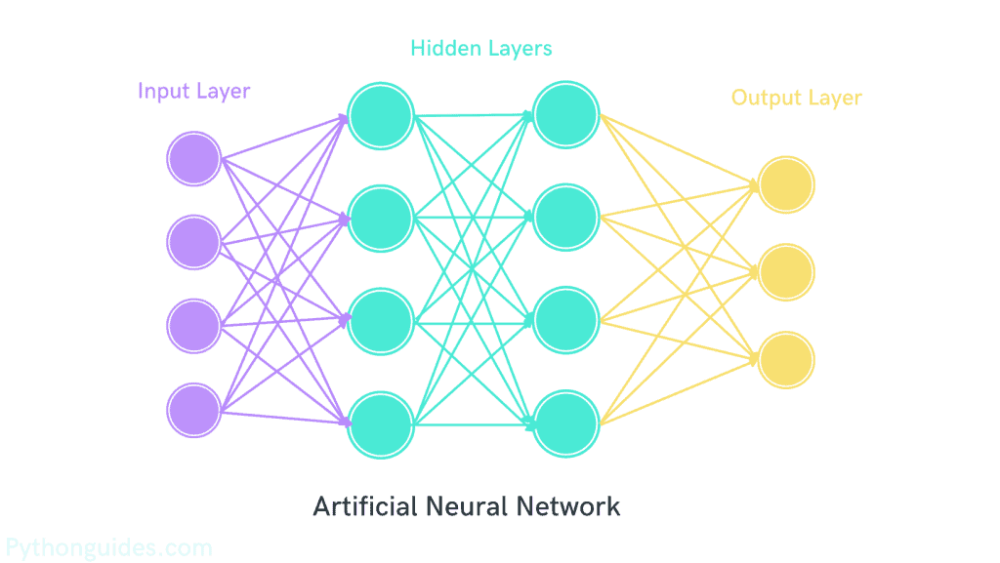
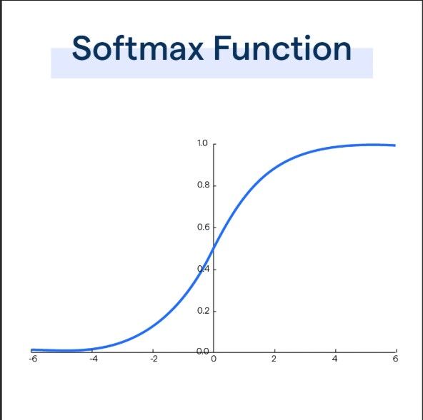
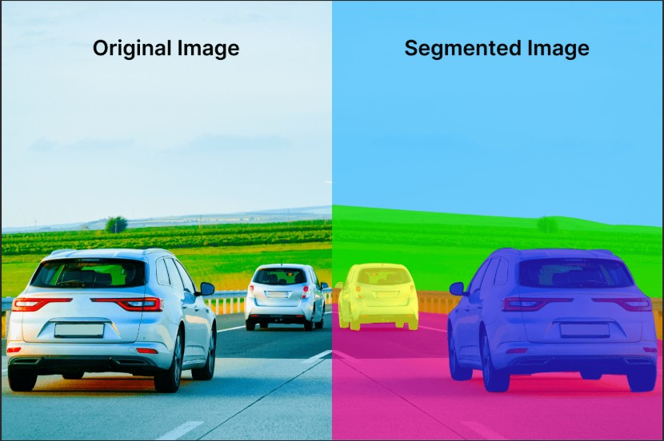
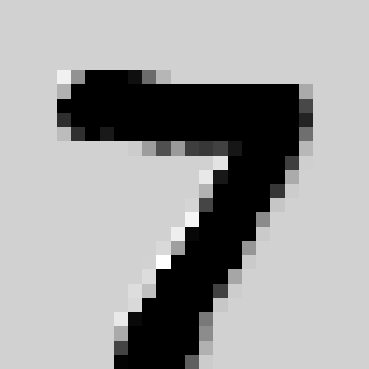

## **Welcome to Day 4 of the Bootcamp!!!**
Today, we'll be learning how **image recognition** happens, and how **Deep Learning (DL)** works!
CNN_Model_Training colab link: [CNN_Model_Training](https://colab.research.google.com/drive/11mLrtD7BT0J9wWm1ugqtHlw1g81FfiAl?usp=sharing)
---

## **1. Recap**

### **1.1 What are ANN's?**
An **Artificial Neural Network (ANN)** is a type of model in Deep Learning that tries to work like the human brain — it learns by finding patterns in data.

- Just like our brain has neurons that send signals to each other, an ANN has **artificial neurons (nodes)** connected in layers that pass information forward and adjust themselves to learn.
- ANN is made up of layers of neurons:
  - **Input Layer**: Receives the data.
  - **Hidden Layers**: Where the actual learning happens — the model adjusts its weights and biases for each neuron during training.
  - **Output Layer**: Produces the final prediction.



```python
# Define the model
model = Sequential([
    Input(shape=(4,)),            # Input layer (4 features)
    Dense(4, activation='relu'),  # Hidden layer 1
    Dense(4, activation='relu'),  # Hidden layer 2
    Dense(3, activation='sigmoid') # Output layer (multi-class classification)
])

# Compile the model
model.compile(optimizer='adam', loss='binary_crossentropy', metrics=['accuracy'])
```

### **1.2 Key Terms**
- **Activation Function**: Adds non-linearity (mathematically) for a neuron, so the model can learn complex patterns instead of simple linear ones.
  - **ReLU (Rectified Linear Unit)**: The most commonly used activation function in deep learning. It outputs the input directly if it is positive; otherwise, it outputs zero.  
    **Formula**: `f(x) = max(0, x)`  
    **Advantages**:  
      - Computationally efficient.  
      - Helps mitigate the vanishing gradient problem (After a point of time, the network stops learning ).  
    **Disadvantages**:  
      - Can suffer from the "dying ReLU" problem, where neurons output zero for all inputs.
    

  - **Sigmoid**: Maps input values to a range between 0 and 1, making it useful for binary classification tasks.  
    **Formula**: `f(x) = 1 / (1 + e^(-x))`  
    **Advantages**:  
      - Outputs can be interpreted as probabilities.  
    **Disadvantages**:  
      - Can cause vanishing gradients for very large or small input values.  
    

  - **Tanh (Hyperbolic Tangent)**: Similar to Sigmoid but maps inputs to a range between -1 and 1.  
    **Formula**: `f(x) = (e^x - e^(-x)) / (e^x + e^(-x))`  
    **Advantages**:  
      - Helps with optimization.  
    **Disadvantages**:  
      - Can still suffer from vanishing gradients.
    


  - **Softmax**: Converts raw scores (logits) into probabilities for multi-class classification tasks.  
    **Formula**: `f(xᵢ) = e^(xᵢ) / Σ(e^(xⱼ))` (for all `j`)  
    **Advantages**:  
      - Ensures the output probabilities sum to 1.  
    **Disadvantages**:  
      - Not suitable for hidden layers, only used in the output layer for multi-class classification.
    

- **Optimizers**: Algorithms that improve model learning by adjusting weights and biases during training to reduce error.
- **Loss Function**: Measures how wrong the model’s predictions are — the model tries to minimize this loss while learning.

---

## **2. Major Applications of CNNs**

CNNs are widely used in various fields due to their ability to process grid-like data such as images. Here are some key applications:

- **Image Classification**: Assigning a label to an entire image (e.g., identifying cats, dogs, or cars).
- **Image Segmentation**: Dividing an image into regions and labeling each pixel (e.g., tumor segmentation in medical imaging).
- **Object Detection**: Identifying and localizing multiple objects in an image (e.g., detecting pedestrians in autonomous vehicles).
- **Facial Recognition**: Identifying or verifying individuals based on facial features.
- **Medical Imaging**: Diagnosing diseases from X-rays, MRIs, or CT scans.
- **Autonomous Vehicles**: Recognizing traffic signs, lanes, and obstacles.
- **Satellite Imagery**: Land cover classification, disaster monitoring, and urban planning.
- **Video Analysis**: Action recognition, surveillance, and video classification.

---

### **2.1 Differences in Applications: ANNs vs. CNNs**

Here are the key differences between ANN and CNN applications:

1. **Image Classification**
   **ANN**: Can be used for simple image classification tasks but requires manual feature extraction.  
   **CNN**: Automatically extracts features like edges, textures, and shapes, making it ideal for complex image classification tasks.

2. **Image Segmentation**
   **ANN**: Not suitable for pixel-level tasks like segmentation due to its fully connected structure.  
   **CNN**: Perfect for tasks like semantic and instance segmentation, as it processes spatial relationships in images.

3. **Object Detection**
   **ANN**: Struggles with detecting and localizing multiple objects in an image.  
   **CNN**: Excels at object detection tasks, using architectures like YOLO and Faster R-CNN.

4. **Tabular Data**
   **ANN**: Works well for structured data like spreadsheets, where relationships between features are not spatial.  
   **CNN**: Not typically used for tabular data, as it is designed for grid-like data such as images.

5. **Video Analysis** 
   **ANN**: Limited in handling sequential frames in videos.  
   **CNN**: Can process video data by extending its architecture to 3D CNNs for spatiotemporal analysis.

---

## **3. Problems Solved by CNNs**

CNNs are the backbone of modern computer vision, solving problems like image classification, segmentation, and object detection. Below are the details of these problems and popular models used for each:

### **3.1 Image Classification**
Image classification involves assigning a single label to an entire image. For example, determining whether an image contains a cat, dog, or car.

#### **Popular Models**
- **AlexNet**: Introduced ReLU activation and dropout, revolutionizing deep learning in 2012.
- **VGGNet**: Known for its simplicity and use of small (3×3) convolution filters.
- **ResNet**: Introduced residual connections, enabling the training of very deep networks.
- **EfficientNet**: Balances model size, accuracy, and computational efficiency.


---

### **3.2 Image Segmentation**
Image segmentation involves dividing an image into regions, where each pixel is assigned a label. It is more detailed than classification.

#### **Popular Models**
- **U-Net**: Designed for biomedical image segmentation, uses an encoder-decoder structure.
- **Mask R-CNN**: Extends Faster R-CNN for instance segmentation.


---

### **3.3 Object Detection**
Object detection identifies and localizes multiple objects in an image by drawing bounding boxes around them.

#### **Popular Models**
- **YOLO (You Only Look Once)**: Real-time object detection with high speed and accuracy.
- **SSD (Single Shot MultiBox Detector)**: Balances speed and accuracy for real-time applications.
- **Faster R-CNN**: Combines region proposal networks with CNNs for high accuracy.


---

## **4. Convolutional Neural Networks (CNNs)**

### **4.1 Conversion of Images to Pixel Values for Both Grayscale and RGB**

Images are essentially grids of pixels, where each pixel represents a small part of the image. These pixels are stored as numerical values that describe the intensity of light or color at that point. Computers process these numerical values to analyze and understand images.

---

#### **Grayscale Images**

A grayscale image contains only shades of gray, ranging from black to white. Each pixel in a grayscale image is represented by a single value, typically between 0 and 255:
- **0** represents black (no light).
- **255** represents white (maximum light).
- Values in between (e.g., 128) represent shades of gray.

**Example**:  
A 3×3 grayscale image might look like this:

| **Pixel** | **Value** |
|-----------|-----------|
| Black     | 0         |
| Dark Gray | 50        |
| Light Gray| 200       |

**Matrix Representation**:
```
[[  0, 128, 255 ],
 [ 64, 200,  50 ],
 [128, 255,   0 ]]
```

---

#### **RGB Images**

An RGB image contains three color channels: **Red**, **Green**, and **Blue**. Each pixel is represented by three values, one for each channel, typically between 0 and 255:
- **(255, 0, 0)** represents pure red.

- **(0, 255, 0)** represents pure green.

- **(0, 0, 255)** represents pure blue.

- **(255, 255, 255)** represents white (all channels at maximum intensity).

- **(0, 0, 0)** represents black (all channels at zero intensity).

**Example**:  
A 2×2 RGB image might look like this:

| **Pixel**       | **RGB Value**       |
|------------------|---------------------|
| Red             | (255, 0, 0)        |
| Green           | (0, 255, 0)        |
| Blue            | (0, 0, 255)        |
| Yellow          | (255, 255, 0)      |

**Matrix Representation**:
```
Red Channel:   [[255,   0],
                [  0, 255]]

Green Channel: [[  0, 255],
                [  0, 255]]

Blue Channel:  [[  0,   0],
                [255,   0]]
```

---

#### **How Images Are Stored and Processed**

1. **Grayscale Images**: Stored as a 2D matrix where each value represents the intensity of light at that pixel.
2. **RGB Images**: Stored as a 3D matrix (Height × Width × 3), where the third dimension represents the three color channels (Red, Green, Blue).

---

#### **Example in Python**

```python
import cv2
import numpy as np

# Load a grayscale image
grayscale_image = cv2.imread('example_grayscale.jpg', cv2.IMREAD_GRAYSCALE)
print("Grayscale Image Shape:", grayscale_image.shape)
print("Grayscale Pixel Values:\n", grayscale_image)

# Load an RGB image
rgb_image = cv2.imread('example_rgb.jpg', cv2.IMREAD_COLOR)
rgb_image = cv2.cvtColor(rgb_image, cv2.COLOR_BGR2RGB)  # Convert BGR to RGB
print("RGB Image Shape:", rgb_image.shape)
print("RGB Pixel Values:\n", rgb_image)
```

---

#### **Key Takeaways**
1. Grayscale images are simpler, with one value per pixel, making them easier to process.
2. RGB images are more complex, with three values per pixel, allowing for full-color representation.
3. Both types of images are represented as numerical matrices, which can be processed by machine learning models.

---

### **4.1 What are CNN's?**
A Convolutional Neural Network (CNN) is a Deep Learning model designed for grid-like data such as images, where a grayscale image is a single H×W (Height x Width) pixel matrix and an RGB image is three H×W (Height x Width) matrices stacked together, and the learnable parameters are the weights and biases.

- Instead of looking at the whole image at once, CNNs look at **small local regions (patches)** to learn patterns like edges, textures, shapes, and then combine them to recognize higher-level features.

### **4.2 How CNNs Work?**
A CNN has **three main types of layers**:

#### **4.2.1 Convolution Layer**

The convolution layer is the core building block of CNNs. It applies filters (kernels) to the input image to extract features like edges, textures, and patterns. Below, we break down the key concepts of **stride**, **kernel**, and **padding**, using the same matrix for all examples.

---

##### **Example Matrix**

We will use the following 5×5 input matrix for all examples:

```plaintext
Input Matrix:
[ [ 1   2   3   4   5 ]
  [ 6   7   8   9  10 ]
  [ 11  12  13  14  15 ]
  [ 16  17  18  19  20 ]
  [ 21  22  23  24  25 ] ]
```

---

##### **Stride**

- **Definition**: Stride determines how the filter (kernel) moves across the input matrix.  
- **How it works**: A stride of 1 means the filter moves 1 step at a time, while a stride of 2 skips 1 step between positions.  
- **Effect**: Larger strides reduce the size of the output matrix, while smaller strides preserve more detail.

**Example**:  
Using a 3×3 kernel with a stride of 1:

```plaintext
Kernel:
[ [ 1   0   1 ]
  [ 0   1   0 ]
  [ 1   0   1 ] ]
```

**Step-by-Step Calculation**:  
Place the kernel on the top-left corner of the input matrix.
Perform element-wise multiplication and sum the results.
Move the kernel by the stride (1 step in this case) and repeat.

**Output Matrix (Stride = 1)**:
```plaintext
[ [ 50   60   70 ]
  [ 110  120  130 ]
  [ 170  180  190 ] ]
```

With a stride of 2, the kernel skips every other step:

**Output Matrix (Stride = 2)**:
```plaintext
[ [ 50   70 ]
  [ 170  190 ] ]
```

---

##### **Kernel (Filter)**

- **Definition**: A kernel (or filter) is a small matrix (e.g., 3×3) that slides over the input matrix to detect patterns.  
- **How it works**: Each kernel performs element-wise multiplication with the input matrix and sums the results to produce a single value in the output matrix.  
- **Purpose**: Different kernels detect different features, such as edges, corners, or textures.

**Example**:  
Using the same 3×3 kernel as above:

```plaintext
Kernel:
[ [ 1   0   1 ]
  [ 0   1   0 ]
  [ 1   0   1 ] ]
```

**Step-by-Step Calculation**:  
Place the kernel on the top-left corner of the input matrix.
Multiply each element of the kernel with the corresponding element of the input matrix.
Sum the results to get the output value for that position.
Slide the kernel to the next position (based on the stride) and repeat.

**Output Matrix (Stride = 1)**:
```plaintext
[ [ 50   60   70 ]
  [ 110  120  130 ]
  [ 170  180  190 ] ]
```

---

##### **Padding**

- **Definition**: Padding adds extra pixels (usually zeros) around the edges of the input matrix.  
- **Why it's needed**: Without padding, the size of the output matrix decreases after each convolution. Padding helps preserve the spatial dimensions of the input.  
- **Types of Padding**:  
  - **Same Padding**: Adds enough padding to ensure the output size matches the input size.  
  - **Valid Padding**: No padding is added, so the output size is smaller than the input.

**Example**:  
Using the same 5×5 input matrix and 3×3 kernel:

**Input Matrix (No Padding)**:
```plaintext
[ [ 1   2   3   4   5 ]
  [ 6   7   8   9  10 ]
  [ 11  12  13  14  15 ]
  [ 16  17  18  19  20 ]
  [ 21  22  23  24  25 ] ]
```

**Input Matrix (With Padding)**:
```plaintext
[ [ 0   0   0   0   0   0   0 ]
  [ 0   1   2   3   4   5   0 ]
  [ 0   6   7   8   9  10   0 ]
  [ 0  11  12  13  14  15   0 ]
  [ 0  16  17  18  19  20   0 ]
  [ 0  21  22  23  24  25   0 ]
  [ 0   0   0   0   0   0   0 ] ]
```

With padding, the output matrix size remains the same as the input matrix.

---

#### **4.2.2 Pooling Layer**

- **Definition**: Pooling reduces the size of the feature map by summarizing regions of the input matrix.  
- **Types**:  
  - **Max Pooling**: Takes the maximum value in each region.  
  - **Average Pooling**: Takes the average value in each region.

**Example**:  
Using the same 5×5 input matrix:

```plaintext
Input Matrix:
[ [ 1   2   3   4   5 ]
  [ 6   7   8   9  10 ]
  [ 11  12  13  14  15 ]
  [ 16  17  18  19  20 ]
  [ 21  22  23  24  25 ] ]
```

**Max Pooling (2×2, Stride = 2)**:
```plaintext
[ [ 7   9 ]
  [ 17  19 ] ]
```

**Average Pooling (2×2, Stride = 2)**:
```plaintext
[ [ 6.5   8.5 ]
  [ 16.5  18.5 ] ]
```

Pooling reduces the size of the matrix while retaining the most important information.

---
#### **4.2.3 Flattening Layers**
- **Definition**: Flattening is the process of converting a multi-dimensional feature map (e.g., 2D or 3D) into a 1D vector.
- **Why it's needed**: Fully connected (dense) layers require a 1D input, so the output of convolution and pooling layers must be flattened before being passed to dense layers.
- **How it works**: The spatial dimensions (height, width, channels) of the feature map are unrolled into a single vector.
  
**Example**:  
If the output of the pooling layer is a 3D tensor of shape `(4, 4, 8)` (Height × Width × Channels), flattening converts it into a 1D vector of size `4 × 4 × 8 = 128`.

#### **4.2.4 Fully Connected Layer**
- Predicts the outcome based on the extracted features passed to it.


---

## **5. Intuition behind finding edges and textures using CNN using MNIST Dataset for 1 layer**
### **5.1 Input Image**
The MNIST input is a 28×28 grayscale image containing a handwritten digit.
This raw image serves as the starting point for feature extraction.
Even before convolution, the CNN receives a pixel matrix where:

Dark areas represent the background.

Bright areas represent the handwritten stroke.


### **5.2 First Convolution Layer (Conv1) – Detecting Simple Edges**

The first convolution layer applies a set of filters to the input image to detect simple features such as edges and gradients. Each filter produces a **feature map**, which highlights specific patterns in the image. 

- Faint vertical edge getting represented in the first feature map.


- Vertical and Horizontal edges together, with the corners, are getting represented in the second feature map, representing 7 as an image.


- The background gets represented in the third feature map.



- The top vertical edge, and the rightmost horizontal edge gets represented, completing the shape in this particular feature map.


- The rightmost curve, gets represented in this particular feature map.


- In this feature map, the topmost horizontal curve, and the leftmost vertical curve faintly gets represented.


Each feature map is the result of applying a specific filter (kernel) to the input image, followed by the ReLU activation function, which ensures that only positive values are retained. These feature maps are then passed to the next layer for further processing.

---

## **6. Tensors, Parallelism, and Training in CNNs**

In this section, we will explore the fundamental building blocks of deep learning — tensors, the importance of GPUs/TPUs for parallelism, and how the training process works in CNNs.

---

### **6.1 What Are Tensors?**

Tensors are the core data structure used in deep learning. They are generalizations of matrices to higher dimensions and are used to represent data in a structured way.

- **Scalars (0D)**: A single number (e.g., `5`).
- **Vectors (1D)**: A list of numbers (e.g., `[1, 2, 3]`).
- **Matrices (2D)**: A grid of numbers (e.g., a 2×2 matrix):
  ```plaintext
  [ [1, 2],
    [3, 4] ]
  ```
- **Tensors (nD)**: Generalized n-dimensional arrays. For example:
  - A 3D tensor could represent an RGB image (Height × Width × Channels):
    ```plaintext
    [ [ [R1, G1, B1], [R2, G2, B2] ],
      [ [R3, G3, B3], [R4, G4, B4] ] ]
    ```
  - A 4D tensor could represent a batch of images (Batch × Height × Width × Channels).

**Why Tensors?**
- Tensors allow us to represent complex data like images, videos, and text in a structured way.
- They are optimized for mathematical operations like matrix multiplication, which is the backbone of deep learning.

---

### **6.2 Why GPUs and TPUs Are Essential**

Images are essentially large matrices, and processing them requires a lot of computational power. GPUs (Graphics Processing Units) and TPUs (Tensor Processing Units) are specialized hardware designed to handle these computations efficiently.

#### **6.2.1 The Role of GPUs**
- GPUs are designed for parallel processing, making them ideal for matrix operations.
- In CNNs, operations like convolution and backpropagation involve millions of matrix multiplications, which GPUs can handle simultaneously.
- Example: A single image of size 224×224×3 (Height × Width × Channels) has over 150,000 pixels. Processing a batch of 32 images involves over 4.8 million pixels, which GPUs can process in parallel.

#### **6.2.2 The Role of TPUs**
- TPUs are specialized hardware designed by Google for deep learning tasks.
- They are optimized for tensor operations and are faster than GPUs for certain workloads.
- TPUs are commonly used for large-scale training tasks, such as training models on massive datasets like ImageNet.

#### **6.2.3 Why Parallelism Matters**
- **Matrix Operations**: Convolutions, pooling, and fully connected layers involve matrix multiplications, which are computationally expensive.
- **Batch Processing**: Training on batches of data requires simultaneous processing of multiple images, which GPUs/TPUs excel at.
- **Speed**: Without GPUs/TPUs, training deep learning models would take days or weeks instead of hours.

---

### **6.3 The Training Cycle in CNNs**

Training a CNN involves multiple steps, which are repeated for several epochs until the model converges. Here's how the training process works:

#### **6.3.1 Forward Propagation**
- The input image is passed through the network layer by layer.
- Each layer performs operations like convolution, activation, and pooling to extract features.
- The final layer produces predictions (e.g., class probabilities for classification tasks).

#### **6.3.2 Loss Calculation**
- The model's predictions are compared to the true labels using a loss function (e.g., cross-entropy loss for classification).
- The loss quantifies how far the predictions are from the actual labels.

#### **6.3.3 Backpropagation**
- Backpropagation computes the gradients of the loss with respect to the model's parameters (weights and biases).
- Gradients are calculated using the chain rule of calculus, starting from the output layer and propagating backward through the network.

#### **6.3.4 Weight Updates**
- The gradients are used to update the model's parameters using an optimizer (e.g., SGD, Adam).
- The learning rate controls the size of the updates.

#### **6.3.5 Epochs and Iterations**
- **Epoch**: One complete pass through the entire training dataset.
- **Iteration**: One update of the model's parameters, typically after processing a single batch of data.
- Training involves multiple epochs, with the model improving its predictions over time.

---

### **6.4 How CNN Training Differs from RNN Training**

While the core concepts of training (forward propagation, backpropagation, and weight updates) are the same for CNNs and RNNs, there are key differences in how they process data:

#### **6.4.1 Data Structure**
- **CNNs**: Process grid-like data (e.g., images) where spatial relationships are important.
- **RNNs**: Process sequential data (e.g., text, time series) where temporal relationships are important.

#### **6.4.2 Backpropagation**
- **CNNs**: Use standard backpropagation to compute gradients.
- **RNNs**: Use backpropagation through time (BPTT) to handle sequential dependencies.

#### **6.4.3 Epochs**
- In CNNs, each epoch processes the entire dataset of images.
- In RNNs, each epoch processes sequences, which may involve additional steps to handle variable sequence lengths.

#### **6.4.4 Parallelism**
- CNNs benefit more from GPU/TPU parallelism because images can be processed independently in batches.
- RNNs are less parallelizable due to their sequential nature, where each step depends on the previous one.

---

### **6.5 Summary**

- **Tensors**: The fundamental data structure in deep learning, representing data as n-dimensional arrays.
- **GPUs/TPUs**: Essential for efficient training of CNNs due to their ability to handle parallel computations.
- **Training Cycle**: Involves forward propagation, loss calculation, backpropagation, and weight updates, repeated over multiple epochs.
- **CNN vs. RNN Training**: While the core concepts are similar, CNNs process grid-like data in parallel, whereas RNNs process sequential data step by step.

Understanding these concepts is crucial for building and optimizing deep learning models, especially when working with large datasets and complex architectures.

---

## **7. Advantages and Disadvantages of CNN**

### **7.1 Advantages**
- **Learns hierarchical spatial features** (edges → textures → objects).  
- **Parameter sharing & local connectivity** → fewer parameters and efficient learning for images.  
- **State-of-the-art** for vision tasks and has efficient variants for edge/mobile.  
- **Robust to translation, scaling, and rotation** due to convolution and pooling layers.  
- **Feature extraction is automatic** — no need for manual feature engineering.  
- **Versatility** — can be applied to images, videos, and even sequential data like audio or text (with modifications).  

#### **7.1.1 CNNs for Videos**
- Videos are sequences of frames, where each frame is treated as an image. CNNs extract spatial features from each frame.
- Temporal relationships across frames can be modeled using architectures like RNNs, LSTMs, or 3D CNNs.
- **Applications**: Action recognition, video classification, and object tracking.

### **7.2 Disadvantages**
- **Data hungry** — needs large labeled datasets for best performance.  
- **Compute and memory intensive** (training often requires GPUs/TPUs).  
- **Can overfit** on small datasets.  
- **Lack of interpretability** — CNNs are often considered "black boxes" due to their complexity.  
- **Requires significant hyperparameter tuning** (e.g., kernel size, stride, number of filters) for optimal performance.  

---
CNN_Model_Training colab link: [CNN_Model_Training](https://colab.research.google.com/drive/11mLrtD7BT0J9wWm1ugqtHlw1g81FfiAl?usp=sharing)